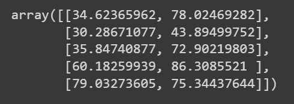
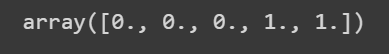
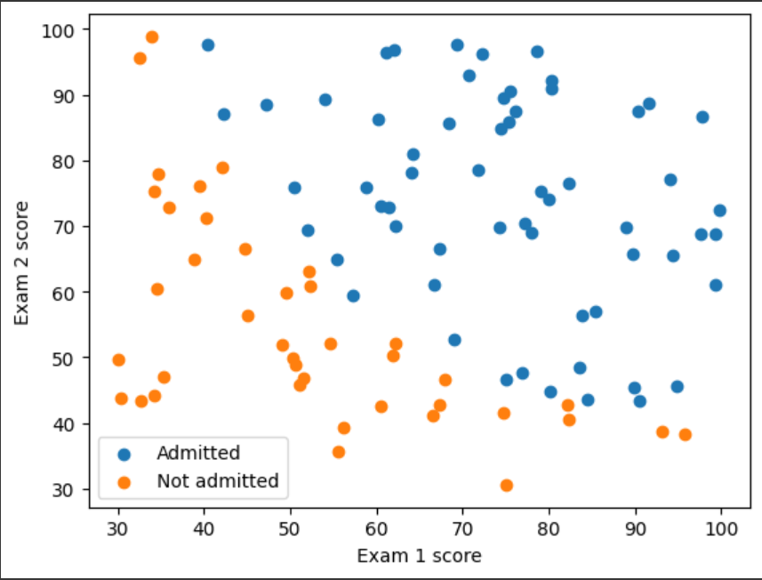
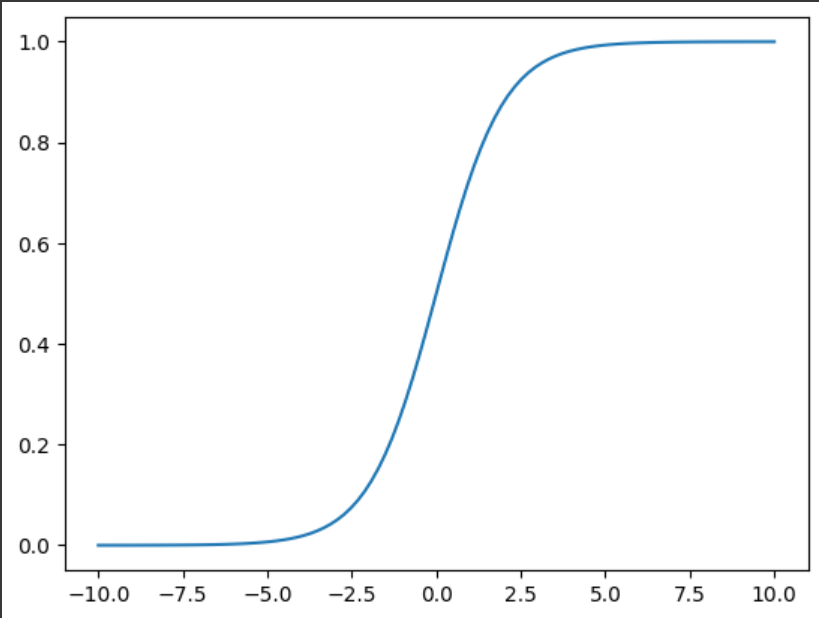
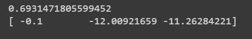
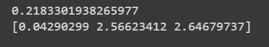
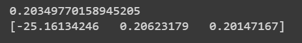
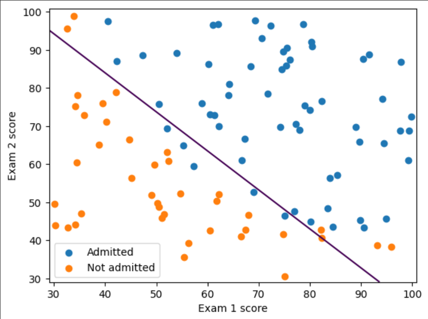
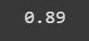

# EXP:5 Implementation-of-Logistic-Regression-Using-Gradient-Descent

Date : 

## AIM:
To write a program to implement the the Logistic Regression Using Gradient Descent.

## Equipments Required:
1. Hardware – PCs
2. Anaconda – Python 3.7 Installation / Jupyter notebook

## Algorithm
1. Import the required Packages and read the .csv file
 
2.   Define a function named costFunction and compute the output
   
3. Define a function named gradientDescent and iterate the loop

4. Predict the required graphs using scatterplots.


## Program:
Program to implement the the Logistic Regression Using Gradient Descent.

Developed by:Sreevarsha.D

RegisterNumber:212221040159
```
import numpy as np
import matplotlib.pyplot as plt
from scipy import optimize

data= np.loadtxt("/content/ex2data1.txt", delimiter=',')
x= data[:, [0,1]]
y= data[:, 2]

x[:5]

y[:5]

plt.figure()
plt.scatter(x[y==1][:,0],x[y==1][:,1],label="Admitted")
plt.scatter(x[y==0][:,0],x[y==0][:,1],label="Not admitted")
plt.xlabel("Exam 1 score")
plt.ylabel("Exam 2 score")
plt.legend()
plt.show()

def sigmoid(z):
  return 1/(1+np.exp(-z))
  
plt.plot
X_plot=np.linspace(-10,10,100)
plt.plot(X_plot, sigmoid(X_plot))
plt.show()

def costFunction(theta,X,y):
  h=sigmoid(np.dot(X,theta))
  J=-(np.dot(y,np.log(h))+np.dot(1-y,np.log(1-h)))/X.shape[0]
  grad=np.dot(X.T,h-y)/X.shape[0]
  return J,grad
  
x_train=np.hstack((np.ones((x.shape[0],1)),x))
theta=np.array([0,0,0])
J, grad=costFunction(theta,x_train,y)
print(J)
print(grad)

x_train=np.hstack((np.ones((x.shape[0],1)),x))
theta=np.array([-24, 0.2, 0.2])
J, grad=costFunction(theta,x_train,y)
print(J)
print(grad)

def cost(theta, x, y):
  h = sigmoid(np.dot(x, theta))
  J = -(np.dot(y, np.log(h)) + np.dot(1 - y, np.log(1 - h))) / x.shape[0]
  return J
  
def gradient(theta, x, y):
  h = sigmoid(np.dot(x, theta))
  grad = np.dot(x.T, h - y) / x.shape[0]
  return grad
  
x_train=np.hstack((np.ones((x.shape[0],1)),x))
theta=np.array([0,0,0])
res = optimize.minimize(fun=cost, x0=theta, args=(x_train, y), method='Newton-CG', jac=gradient)
print(res.fun)
print(res.x)

def plotDecisionBoundary(theta,X,y):
  x_min, x_max= X[:,0].min()-1, X[:,0].max()+1
  y_min, y_max= X[:,0].min()-1, X[:,0].max()+1
  xx, yy = np.meshgrid(np.arange(x_min, x_max, 0.1), np.arange(y_min, y_max, 0.1))
  X_plot=np.c_[xx.ravel(),yy.ravel()]
  X_plot=np.hstack((np.ones((X_plot.shape[0],1)),X_plot))
  y_plot=np.dot(X_plot,theta).reshape(xx.shape)

  plt.figure()
  plt.scatter(X[y==1][:,0],X[y==1][:,1],label="Admitted")
  plt.scatter(X[y==0][:,0],X[y==0][:,1],label="Not admitted") 
  plt.contour(xx, yy, y_plot, levels=[0])
  plt.xlabel("Exam 1 score")
  plt.ylabel("Exam 2 score")
  plt.legend()
  plt.show()
  
plotDecisionBoundary(res.x, x, y)

prob=sigmoid(np.dot(np.array([1, 45, 85]), res.x))
print(prob)

def predict(theta, x):
  x_train=np.hstack((np.ones((x.shape[0],1)),X))
  prob=sigmoid(np.dot(x_train,theta))
  return (prob>=0.5).astype(int)
  
np.mean(predict(res.x, x) == y )

```

## Output:
Array value of x



Array value f y



Exam 1 score graph



Sigmoid function graph



X_train_grad value



Y_train_grad value



Print res.x



Decision boundary graph for exam score



Probability value


Prediction value of mean




## Result:
Thus the program to implement the the Logistic Regression Using Gradient Descent is written and verified using python programming.

